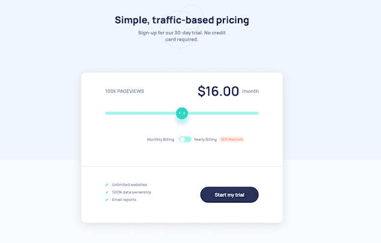

# Frontend Mentor - Interactive pricing component solution

This is a solution to the [Interactive pricing component challenge on Frontend Mentor](https://www.frontendmentor.io/challenges/interactive-pricing-component-t0m8PIyY8).

## Table of contents

- [Overview](#overview)
  - [The challenge](#the-challenge)
  - [Screenshot and Live Site](#screenshot)
- [My process](#my-process)
  - [Built with](#built-with)
  - [Useful resources](#useful-resources)
  - [Future Improvements](#future-improvements)
- [Author](#author)

## Overview

### The challenge

Users should be able to:

- View the optimal layout for the app depending on their device's screen size
- See hover states for all interactive elements on the page
- Use the slider and toggle to see prices for different page view numbers

### Screenshot and Live Site

  

- Live Site URL: [Interactive pricing component](https://mathieu-superpose.github.io/interactive_pricing_component/)

## My process

### Built with

- Semantic HTML5 markup
- CSS custom properties
- Flexbox
- Javacript

### Useful resources

- [Custom slider](https://codepen.io/nlfonseca/pen/MwbovQ)

### Future improvements

- Make the right part of the slider (inactive) a different color from the left part (active)

## Author

- Website: [Mathieu JOLY](http://www.tropbeau.site/)
- Frontend Mentor - [@mathieu-superpose](https://www.frontendmentor.io/profile/mathieu-superpose)
- [Linkedin](https://www.linkedin.com/in/mathieu--joly/)
